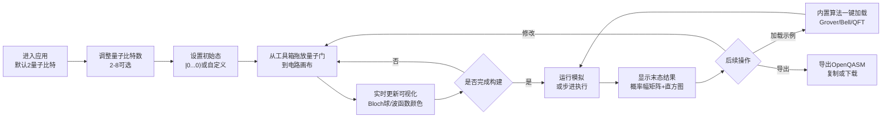

## 1. 产品概述
量子电路模拟与可视化工具是一款面向量子计算教学和算法前期验证的Web应用。通过直观的图形化界面让用户拖放量子门构建线路，实时观察量子态演化过程，帮助理解量子叠加、纠缠、干涉等核心概念。
- 目标用户：量子计算课程学生、教师、算法研究人员、量子计算爱好者
- 核心价值：将抽象的量子力学转化为直观可视化的操作过程，降低量子计算学习门槛

## 2. 核心功能

### 2.1 用户角色
本工具无需用户登录注册，所有用户均为普通使用者角色。
| 角色 | 注册方式 | 核心权限 |
|------|----------|----------|
| 普通用户 | 无需注册 | 构建电路、运行模拟、查看可视化、加载示例、导出OpenQASM |

### 2.2 功能模块
1. **主工作台**：量子门工具箱、电路画布、控制面板
2. **状态可视化区**：Bloch球阵列、波函数颜色映射
3. **结果输出区**：概率幅矩阵、测量概率直方图
4. **示例与导出**：内置算法示例加载、OpenQASM格式导出

### 2.3 页面详情
| 页面名称 | 模块名称 | 功能描述 |
|----------|----------|----------|
| 主工作台 | 量子门工具箱 | 展示可拖放的量子门列表：单量子门(H/X/Y/Z/S/T/Rx/Ry/Rz)、受控门(CNOT/CZ/CY)、多量子门(Toffoli/SWAP)、测量门 |
| 主工作台 | 电路画布 | 2-8条量子比特线路，拖放量子门到指定位置，支持删除、移动门操作 |
| 主工作台 | 控制面板 | 量子比特数量调节(2-8)、初始态设置、运行模拟按钮、清除电路按钮、步进执行控制 |
| 状态可视化区 | Bloch球可视化 | 为每个量子比特生成独立的Bloch球，实时显示态矢量在球面上的位置，支持旋转交互 |
| 状态可视化区 | 波函数颜色映射 | 2^N维状态向量的模和相位用颜色网格显示，颜色深浅代表概率幅大小，色相表示相位 |
| 结果输出区 | 概率幅矩阵 | 表格展示所有计算基态的复数概率幅(实部+虚部)，并显示对应概率 |
| 结果输出区 | 测量直方图 | 条形图展示2^N个基态的测量概率分布，支持按概率排序 |
| 示例与导出 | 算法示例 | 下拉选择Grover搜索、Bell态制备、量子傅里叶变换(QFT)示例一键加载 |
| 示例与导出 | 导出功能 | 将当前电路转换为OpenQASM 2.0格式代码，支持复制和下载 |

## 3. 核心流程
用户进入工具后默认初始化2量子比特系统。用户可从工具箱拖放量子门到画布的量子比特线路上，构建所需的量子电路。每添加或删除一个量子门，系统会实时计算并更新所有量子比特的Bloch球表示和波函数颜色映射。用户可以调整量子比特数量、设置初始量子态，然后点击"运行模拟"按钮完成全电路模拟，在概率幅矩阵和直方图中查看末态结果。用户也可使用内置示例快速加载经典电路，或将当前电路导出为OpenQASM文件。

## 4. 用户界面设计

### 4.1 设计风格
- **主色调**：深空靛蓝(#0f172a)背景配极光青(#06b6d4)与量子紫(#a855f7)渐变强调，营造量子物理的科技神秘感
- **次色调**：相位彩虹色(HSV色环)用于波函数相位可视化，概率用青色到品红的渐变色
- **按钮风格**：半透明玻璃拟态(Glassmorphism)，圆角12px，带青色发光边框和悬停微上浮动画
- **字体**：标题使用Orbitron(未来科技感等宽字体)，正文使用JetBrains Mono(等宽字体便于显示数学符号和矩阵)
- **布局风格**：三栏布局(左工具箱、中画布+控制面板、右可视化+结果区)，卡片式模块间带发光分割线
- **图标风格**：使用自定义SVG量子门符号，Bloch球用Three.js渲染3D图形

### 4.2 页面设计概述
| 页面名称 | 模块名称 | UI元素 |
|----------|----------|--------|
| 主工作台 | 量子门工具箱 | 网格布局卡片，每张卡片含量子门矩阵符号+名称，可拖拽，悬停显示矩阵定义 |
| 主工作台 | 电路画布 | 白色水平线路(量子比特)，左侧标注q[0]-q[N-1]，量子门为圆角彩色方块，受控门带虚线连接线，支持右键删除 |
| 主工作台 | 控制面板 | 顶部工具栏，滑块选择比特数，输入框设置初始态角度，渐变色大按钮"运行模拟"，发光LED状态指示灯 |
| 状态可视化区 | Bloch球阵列 | 2×4网格布局的3D球体，带XYZ坐标轴，量子态为带拖尾的发光箭头，鼠标可旋转视角 |
| 状态可视化区 | 波函数颜色映射 | 网格方块阵列(2-256格)，每格底色表示模长，中心色相圆环表示相位，悬停显示复数数值 |
| 结果输出区 | 概率幅矩阵 | 斑马纹交替行表格，三列：基态二进制、概率幅(a+bi)、概率百分比，支持按概率排序 |
| 结果输出区 | 测量直方图 | 竖向条形图，柱子按概率渐变色填充，顶部标注概率值，鼠标悬停高亮对应基态 |
| 示例与导出 | 算法示例 | 下拉选择框，选中后电路画布自动填充对应门序列 |
| 示例与导出 | 导出功能 | 模态弹窗显示OpenQASM代码，带行号高亮，按钮"复制到剪贴板"和"下载.qasm文件" |

### 4.3 响应式
桌面端优先设计(最小宽度1280px)：三栏固定布局。
平板端(768-1279px)：改为上下布局，工具箱移到顶部横排，画布与可视化区左右分栏。
移动端(<768px)：单栏垂直堆叠，所有区块按顺序排列，量子门工具箱改为可折叠抽屉。
触摸屏支持：量子门长按拖拽，Bloch球双指旋转缩放。

### 4.4 3D场景指导(Bloch球)
- **环境**：深色星空背景(深蓝到黑径向渐变)，微弱星点粒子，营造宇宙/量子空间氛围
- **光照**：环境光(强度0.3)提供基础照明，青色方向光(从上方45°)模拟量子场光源，球心施加点光突出态矢量
- **相机设置**：正交投影，初始视角45°俯视角，支持鼠标拖动绕Y/X轴旋转，滚轮缩放
- **构图与焦点**：球体半透明浅蓝色外壳，XYZ轴线白色+彩色标签(x红y绿z蓝)，态矢量为橙色发光箭头，箭头端点有明亮粒子，路径带淡色拖尾
- **交互与动画**：态矢量切换使用球面插值动画(0.4秒缓动)，球体自动缓慢自转(每秒10°)，悬停箭头显示态坐标(θ,φ)
- **后处理效果**：轻度Bloom发光效果(0.3强度)让量子态箭头微微发光，FXAA抗锯齿
- **性能预算**：每个Bloch球使用独立的Three.js场景实例，最多8个同时渲染，使用InstancedMesh优化粒子效果，保持60fps帧率
