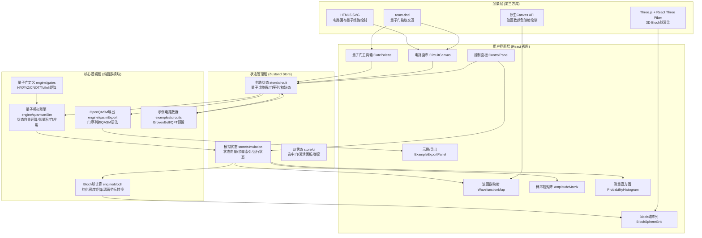

## 1. 架构设计



## 2. 技术说明

- **前端框架**：React@18 + TypeScript@5 + Vite@5（高性能编译，TS类型安全）
- **状态管理**：Zustand@4（轻量级，支持中间件devtools，无需Provider嵌套）
- **样式方案**：TailwindCSS@3.4 + CSS变量主题系统（量子深空主题定制）
- **3D渲染**：three@0.160 + @react-three/fiber@8 + @react-three/drei@9（Bloch球3D可视化）
- **拖放交互**：react-dnd@16 + react-dnd-html5-backend@16（量子门拖放）
- **数学计算**：自实现复数运算与张量积矩阵乘法（纯TypeScript，零数学库依赖）
- **图标**：react-icons@5（lucide风格，控制面板图标）

## 3. 目录结构与路由

本工具为单页应用(SPA)，无需路由切换，所有功能在 `/` 主路由下完成。

```
src/
├── main.tsx                    # 入口文件
├── App.tsx                     # 顶层布局(三栏结构)
├── index.css                   # 全局样式 + Tailwind + 主题CSS变量
├── types/
│   └── quantum.ts              # 类型定义：QGate, QubitState, Complex等
├── engine/                     # 核心计算引擎(纯函数，无副作用)
│   ├── complex.ts              # 复数运算：add/mul/div/conj/modulus
│   ├── gates.ts                # 量子门矩阵：H,X,Y,Z,S,T,CNOT,CZ,Toffoli,SWAP,测量
│   ├── quantumSim.ts           # 状态向量模拟：initState/applyGate/runCircuit/getProbabilities
│   ├── bloch.ts                # Bloch球计算：partialTrace/stateToAngles/stateToXYZ
│   └── qasmExport.ts           # OpenQASM导出：gateToQasm/circuitToQasm
├── store/                      # Zustand状态管理
│   ├── circuitStore.ts         # 电路相关状态：qubitCount/gates/initialState
│   ├── simulationStore.ts      # 模拟状态：stateVector/currentStep/isRunning
│   └── uiStore.ts              # UI状态：selectedGate/modalOpen/activeTab
├── components/
│   ├── layout/
│   │   ├── Header.tsx          # 顶部标题栏(Logo+导出按钮)
│   │   ├── LeftPanel.tsx       # 左栏容器(工具箱)
│   │   ├── CenterPanel.tsx     # 中栏容器(画布+控制)
│   │   └── RightPanel.tsx      # 右栏容器(可视化+结果)
│   ├── gate/
│   │   ├── GatePalette.tsx     # 量子门工具箱(可拖拽门卡片)
│   │   └── GateCard.tsx        # 单量子门卡片组件
│   ├── circuit/
│   │   ├── CircuitCanvas.tsx   # 电路画布(SVG+DnD放置目标)
│   │   ├── QubitLine.tsx       # 单条量子比特水平线
│   │   └── GateNode.tsx        # 画布上的门节点(可选中/删除)
│   ├── control/
│   │   ├── ControlPanel.tsx    # 控制面板(比特数滑块/初始态/运行)
│   │   ├── QubitCountSlider.tsx# 量子比特数量滑块
│   │   ├── InitialStateInput.tsx # 初始态角度输入
│   │   └── StepController.tsx  # 步进执行控制(上一步/下一步)
│   ├── visualization/
│   │   ├── BlochSphereGrid.tsx # Bloch球网格容器
│   │   ├── BlochSphere.tsx     # 单个Bloch球(R3F 3D组件)
│   │   ├── WavefunctionMap.tsx # 波函数颜色映射(Canvas)
│   │   └── PhaseLegend.tsx     # 相位色图例
│   ├── results/
│   │   ├── AmplitudeMatrix.tsx # 概率幅矩阵表格
│   │   └── ProbabilityHistogram.tsx # 测量概率直方图(SVG)
│   ├── examples/
│   │   ├── ExampleSelector.tsx # 示例电路选择下拉框
│   │   └── QasmExportModal.tsx # OpenQASM导出弹窗
│   └── common/
│       ├── GlassCard.tsx       # 玻璃拟态卡片容器
│       ├── GlowButton.tsx      # 发光渐变按钮
│       └── TabSwitcher.tsx     # 标签页切换器(可视化/结果)
├── examples/
│   └── circuits.ts             # 预设电路：createBellState/createGrover/createQFT
└── utils/
    ├── color.ts                # 颜色映射工具：phaseToColor/amplitudeToColor
    ├── format.ts               # 格式化工具：complexToString/binaryString/probabilityFormat
    └── dnd.ts                  # DnD拖拽类型常量
```

## 4. 核心数据模型定义

```typescript
// types/quantum.ts

// 复数类型
export interface Complex {
  re: number;
  im: number;
}

// 量子门类型枚举
export type GateType = 
  | 'H' | 'X' | 'Y' | 'Z' | 'S' | 'T' | 'Sdg' | 'Tdg'
  | 'Rx' | 'Ry' | 'Rz'
  | 'CNOT' | 'CZ' | 'CY' | 'SWAP'
  | 'Toffoli' | 'Fredkin'
  | 'Measure';

// 单个量子门实例(放置在电路画布上)
export interface GateInstance {
  id: string;           // 唯一ID，如 gate-uuid-xxxx
  type: GateType;       // 门类型
  targetQubits: number[]; // 作用量子比特索引(CNOT: [控制, 目标], Toffoli: [c1,c2,t])
  column: number;       // 在电路中的列号(时序位置)
  angle?: number;       // 旋转门的角度参数(弧度)
}

// 初始态配置(每个量子比特独立设置)
export interface InitialStateConfig {
  theta: number;        // 布洛赫球极角θ [0, π]
  phi: number;          // 布洛赫球方位角φ [0, 2π]
}

// 模拟结果快照(每个时间步)
export interface SimulationStep {
  stepIndex: number;             // 步骤索引(0=初始态)
  appliedGate: GateInstance | null; // 该步应用的门
  stateVector: Complex[];        // 2^N维状态向量
  singleQubitStates: InitialStateConfig[]; // 各量子比特约化态(θ,φ)
  probabilities: number[];       // 各基态测量概率
}

// Bloch球坐标
export interface BlochCoords {
  x: number;
  y: number;
  z: number;
  theta: number;
  phi: number;
}

// 示例电路定义
export interface ExampleCircuit {
  id: string;
  name: string;
  description: string;
  qubitCount: number;
  initialStates: InitialStateConfig[];
  gates: GateInstance[];
  expectedResults?: string;
}
```

## 5. 核心算法说明

### 5.1 状态向量初始化
- N量子比特系统初始态向量长度为 2^N
- 默认 |0...0⟩：stateVector[0] = 1+0i，其余为0
- 自定义初始态：对每个量子比特独立计算 R_y(θ)·R_z(φ)·|0⟩，依次施加到各量子比特

### 5.2 量子门应用算法
- 单量子门 U 作用于第 k 个比特：
  1. 构造 2^N × 2^N 扩张矩阵：I ⊗ ... ⊗ U(k位) ⊗ ... ⊗ I
  2. 或更高效的直接索引映射：对每个计算基态 |i⟩，将第 k 位翻转映射到 j，按 U[0/1][0/1] 系数加权
- CNOT(控制c, 目标t)：遍历所有基态，若第c位=1则翻转第t位
- Toffoli(c1,c2,t)：两位控制均为1时翻转目标位
- 所有运算使用复数乘加：Complex = re*re' - im*im' + i(re*im' + im*re')

### 5.3 单量子比特约化态(Bloch球计算)
对多量子比特系统中第k个比特：
1. 对其余所有比特求偏迹得到 2×2 约化密度矩阵 ρ
2. 计算 Bloch 向量：r_x = 2·Re(ρ[0][1]), r_y = 2·Im(ρ[0][1]), r_z = ρ[0][0] - ρ[1][1]
3. 转换为球坐标：θ = arccos(r_z), φ = atan2(r_y, r_x)

### 5.4 OpenQASM 2.0 导出生成
```
// 输出格式示例
OPENQASM 2.0;
include "qelib1.inc";
qreg q[3];
creg c[3];
h q[0];
cx q[0], q[1];
tdg q[1];
measure q[0] -> c[0];
```

## 6. 性能优化策略
- **计算优化**：8量子比特时状态向量为256维复数数组，用索引映射法代替全矩阵乘法，单步运算 < 1ms
- **渲染优化**：Bloch球使用 React Three Fiber 的 useFrame 节流渲染，只有态变化时才更新箭头位置
- **记忆化**：useMemo 缓存相同电路的模拟结果，相同参数只计算一次
- **虚拟滚动**：概率幅矩阵8比特时256行，使用简单的 max-height + overflow 滚动容器
- **防抖**：拖放量子门时 50ms 防抖触发重新模拟，避免频繁运算阻塞UI
